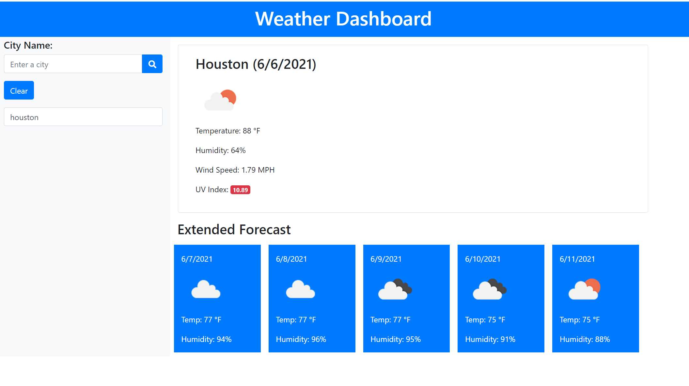

# weatherDash

Build a weather dashboard using the OpenWeather API.

## Technology Used
<ul>
    <li>Open Weather API</li>
    <li>Bootstrap</li>
    <li>Font Awesome</li>
    <li>Javascript</li>
    <li>HTML</li>
</ul>

## Deployed Link and Screenshot

[Weather Dashboard](https://jamiekaczor.github.io/weatherDashboard/)

## Questions
  If you have any questions, please refer to my Github page, [JamieKaczor](https://github.com/JamieKaczor), or contact me through my email, Dignanjk@aol.com